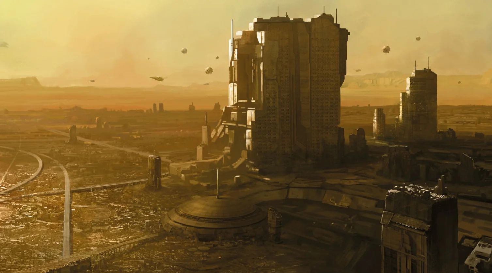


  
  
  
Carthag is approximately 200 kilometers from Arrakeen
and requires a difficult journey across the particularly
inhospitable wastes known as the Broken Lands. It was
constructed by House Harkonnen shortly after it was
granted the fiefdom of Arrakis in 10,114 A.G. While
Arrakeen was for many generations prior the planet’s
largest city and the traditional seat of the planetary
governor, the relatively unadorned and stark nature of
much of the architecture rendered it unsuitable for the
more baroque Harkonnen tastes. As a result, Carthag
was built to suit their own aesthetic preferences.  

If Arrakeen is a city built in defiance of Arrakis, Carthag
is built in carefully willed ignorance. It is a metropolis
constructed as though it were on another world entirely.
The Harkonnens won the fiefdom of Arrakis and began
to exploit it in earnest upon their arrival. The Baron
Dmitri Harkonnen, upon arrival on Arrakis, quickly
decided that the relative austerity of Arrakeen architecture was not to his tastes. As a result, work began on the
creation of Carthag. The new capital city offered a level
of opulence and luxury that Arrakis had never previously
possessed. It is a series of beautifully constructed, carefully adorned and exquisitely rendered citadels.  

### CARTHAG’S LOCATION  
The city’s location was carefully chosen, with the Broken
Lands serving as a highly effective shield against any
threat of attack from Arrakeen save from the air. By
making access on foot virtually impossible, Carthag was
insulated against a great deal of the varieties of political intrigue which make Arrakeen so dangerous. Visitors
from Arrakeen must travel by ornithopter, and, as a
result, can be tracked by Harkonnen security forces from
even before they have entered the confines of the city.  

This position also ensures that Carthag is the first port
of call for mining vessels as they return from the desert.
Rather than laboriously making one’s way to Arrakeen,
it is possible for mining machinery to halt at Carthag
to refuel. This is another, entirely deliberate strategy
on behalf of the Harkonnens, enabling them to keep a
much closer eye on the spice brought in by their various
harvesters. The cynical have suggested that this also
enables the Harkonnens to assemble their own supplies
of spice, out of sight of many of the Emperor’s attendants and wardens. This is, again, entirely deliberate. The
current Baron Harkonnen is renowned for his mastery
of political maneuvering and for the acuity of his trade
deals—few in the Landsraad doubt that he has turned
Carthag into a spice manufacturing facility of some kind.  

### CARTHAG’S ARCHITECTURE  
Carthag is a walled city, and heavily guarded. The
Harkonnens are both wealthy and paranoid, and it is
partly the constant fear of assassination that resulted in
the founding of Carthag. As with Arrakeen, the central
districts of Carthag are occupied chiefly by the palatial
complex constructed for the Harkonnen rulers. These
are huge—much larger than the governor’s residency—
and built entirely with offworld stone in a brutalist
fashion, a symbol of their pitiless character. Steep walls,
impassive stone faces, narrow windows, and an overwhelming dehumanizing aesthetic are characteristics of the city.  

### POPULATION OF CARTHAG  
The population of Carthag is substantially different from
the diversity of Arrakeen. There are almost no Fremen
in the city at all, and the few that are there are treated
poorly and with extreme suspicion, only remaining if
they have no other options. Most of the population are
city-dwellers or former offworlders directly loyal to the
Harkonnens, with a small number from other Houses the
Harkonnens either own or seek to curry favor with. There
is also a substantial deputation from the Guild, with
which the Harkonnens deal extremely carefully, ensuring that their space travel rights are absolutely secure.
Again, it is widely supposed that the Harkonnens can
maintain a special relationship with the Guild as a result
of their own secret supply of the spice.  

The entirety of Carthag is essentially dedicated to procuring the favor of the Landsraad and the Guild. Beyond
the various mining and refining centers, the city is filled
with brothels and drinking establishments, as well as
clubs for the wealthy to indulge their various vices in. It
is a shopfront for everything the Harkonnens can offer to
those who pledge their fealty to the Baron’s strategies.
Whatever predilection one might possess, the various
lairs of corruption in Carthag are likely to offer them—
and in their most expensive and debauched form.  

This reputation is only reinforced by the presence of
the current ruler of Carthag and the planetary governor of Arrakis itself, at least while his uncle, the Baron
Vladimir Harkonnen, remains off planet. Glossu Rabban
is renowned for his brutality and thuggishness. While
the Baron Harkonnen is praised for the sharpness of
his mind (however colossal and perverse his appetites might be), Rabban possesses no such redeeming
features. He is coarse and savage in his approach to the
Fremen and to Arrakis itself—exploiting it and the fief as
ruthlessly as he can. As virtually the entire population of
the planet knows, this comes at the order of the Baron
himself, but the frenzied nature with which the Fremen
are attacked and Arrakis is drained of its spice and
water… that is all Rabban.